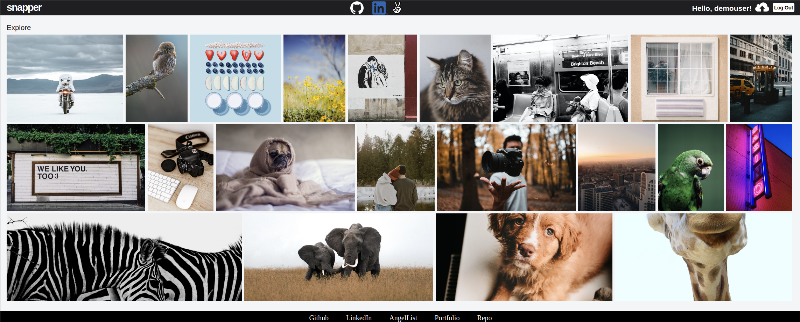
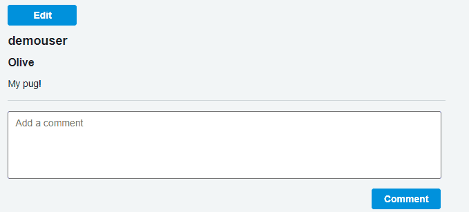

# Snapper

[Live Demo](https://snapper-app.herokuapp.com/#/)

Snapper is a clone of flickr, a social image hosting website. Allowing users to easily save and share their photos around the world.

### Technology 
* Ruby on Rails
* React.js
* Redux
* PostgreSQL
* Rails Active Storage with Amazon's S3


## Photo Index



```
.photos-index {
    display: flex;
    flex-wrap: wrap;
}

.photos-index-item {
    flex-grow: 1;
    position: relative;
    margin-right: 7px;
    margin-bottom: 2px;
}

.photo-img {
    height: 250px;
    min-width: 100%;
    object-fit: cover;
}

```


## Editing Photo Info




```
let titleEdit = this.state.editable ? <input className="photo-show-title-edit" type='text' ref={this.titleEdit} defaultValue={title} /> : 
                                      <h1 className="photo-show-title">{title}</h1>;
                                      
let descriptionEdit = this.state.editable ? <textarea className="photo-show-description-edit" type='text' ref={this.descriptionEdit} defaultValue={description} /> :
                                            <p className="photo-show-description">{description}</p>;
```

```
handleEdit(e) {
    e.preventDefault();

    let newTitle;
    let newDescription;

    if (this.state.editable) {
        newTitle = this.titleEdit.current.value;
        newDescription = this.descriptionEdit.current.value;
    }
    this.setState({ editable: !this.state.editable })

    let editedPhoto = { 
        photo: { id: this.props.photoId, title: newTitle, description: newDescription},
        id: this.props.photoId
    };

    this.props.updatePhoto(editedPhoto)
        .then(() => this.props.fetchPhoto(this.props.photoId))
}
```
